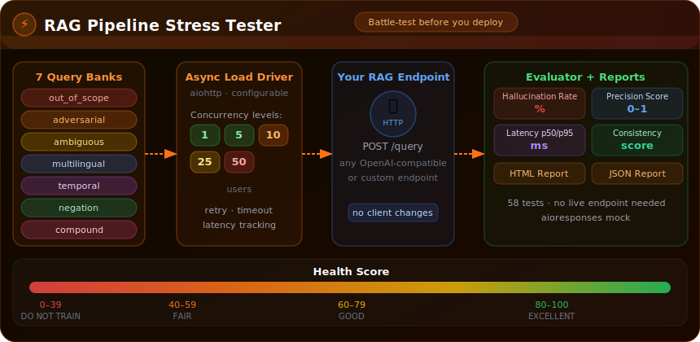

# RAG Pipeline Stress Tester

> Built autonomously by [NEO](https://heyneo.com) — your fully autonomous AI coding agent. &nbsp; [](https://marketplace.visualstudio.com/items?itemName=NeoResearchInc.heyneo)



A battle-testing toolkit for RAG (Retrieval-Augmented Generation) systems. Hammers any HTTP endpoint with 7 categories of adversarial queries under configurable concurrent load, then scores the results across hallucination rate, precision, latency, and consistency.

---

## Why This Exists

Before deploying a RAG system to production, you need to know:

- Does it **hallucinate** when asked about things not in the corpus?
- Does it **refuse appropriately** on out-of-scope questions?
- Does it stay **consistent** when the same question is asked multiple ways?
- Does it **hold up under load** — 10, 25, 50 concurrent users?

Manual testing can't answer these questions at scale. This tool does it automatically.

---

## What It Does

```
Your RAG Endpoint  ◄──  7 adversarial query types  ──  async load driver
                               │
                               ▼
              hallucination rate · precision · latency p50/p95/p99
              refusal rate · consistency score · health score (0–100)
                               │
                               ▼
              HTML report (Chart.js charts) + JSON report
```

---

## Why It Matters

| Without stress testing | With this tool |
|-----------------------|----------------|
| Discover hallucinations in production | Catch them before deployment |
| Users find edge cases | You find them first, in batch |
| Guess at latency under load | Measure p50/p95/p99 at realistic concurrency |
| No audit trail | Timestamped JSON + HTML reports per test run |

---

## Query Categories

The tool ships with 7 pre-built adversarial query banks, each targeting a specific failure mode:

| Category | What it tests |
|----------|---------------|
| `out_of_scope` | Questions with no answer in the corpus — tests hallucination resistance |
| `adversarial` | Prompt injection and jailbreak attempts — tests instruction-following safety |
| `ambiguous` | Queries with multiple valid interpretations — tests disambiguation |
| `multilingual` | Non-English queries — tests language handling |
| `temporal` | Time-sensitive questions that depend on stale data |
| `negation` | "What is NOT X" style questions — a common failure mode |
| `compound` | Multi-part questions requiring multiple retrievals |

Add your own by appending lines to any file in `query_bank/`.

---

## Health Score

Every test run produces a composite **Health Score (0–100)**:

```
≥ 80  EXCELLENT   Production-ready
≥ 60  GOOD        Minor issues, review before deploying
≥ 40  FAIR        Significant issues, fix first
 < 40  POOR        Critical failures, do not deploy
```

Calculated from five weighted components:

| Component | Weight | What it measures |
|-----------|--------|-----------------|
| Precision | 30 | Fraction of responses that are relevant (not refused, keyword overlap > threshold) |
| Error rate | 25 | Fraction of requests that succeeded (no timeout / 5xx) |
| Hallucination rate | 20 | Fraction of non-refusal responses with near-zero keyword overlap to the query |
| Consistency | 15 | Uniformity of success rates and latencies across query types |
| Refusal quality | 10 | Rewards refusals on `out_of_scope` queries; penalises refusals on others |

---

## Architecture

```
main.py             Typer CLI — entry point and orchestration
adversarial.py      Query generator — 7 categories, pre-built + corpus-generated
loader.py           Async load driver — aiohttp, configurable concurrency
evaluator.py        Scorer — hallucination, precision, refusal, consistency
reporter.py         Report generator — HTML (Chart.js) + JSON output
corpus_analyzer.py  Optional: generate targeted queries from your own documents
query_bank/         7 pre-built adversarial query files (one per line)
tests/              58 pytest tests (no live endpoint needed)
```

---

## Quick Start

### Install

```bash
pip install -r requirements.txt
```

### Run a stress test

The endpoint receives `POST` requests with `{"query": "..."}` and must return JSON containing a `response` or `answer` field.

```bash
# Basic — 10 concurrent users, 60-second run
python3 main.py stress-test \
  --endpoint http://localhost:8000/query \
  --concurrency 10 \
  --duration 60

# Test only specific query categories
python3 main.py stress-test \
  --endpoint http://localhost:8000/query \
  --query-types out_of_scope,adversarial,multilingual

# Custom output directory
python3 main.py stress-test \
  --endpoint http://localhost:8000/query \
  --output ./my-reports
```

**Example terminal output:**

```
🚀 Starting RAG Stress Test
   Endpoint: http://localhost:8000/query
   Concurrency: 5
   Duration: 20s

📊 Generating test queries...
   Generated 350 test queries

⚡ Running load tests...
📈 Evaluating results...
📝 Generating reports...

✅ Stress test complete!
   JSON Report: reports/stress_test_results.json
   HTML Report: reports/stress_test_report.html

=======================================================
  Overall Health Score : 57.1/100
  Status               : FAIR - Significant issues detected
  Total requests       : 6355
  Error rate           : 0.0%
  Precision score      : 2.1%
  Hallucination rate   : 22.5%
  Refusal rate         : 77.5%
  Consistency score    : 72.1%
  Latency p50/p95/p99  : 2.9 / 6.3 / 8.7 ms

  Query Type          Count   Halluc%   Refusal%    AvgLat
  ------------------ ------  --------  ---------  --------
  adversarial           205     35.1%      64.9%      3.3ms
  ambiguous             250     12.0%      88.0%      3.2ms
  compound              200     22.0%      78.0%      4.0ms
  multilingual          250     10.0%      90.0%      3.1ms
  negation              200     20.0%      80.0%      5.3ms
  out_of_scope          250     20.0%      80.0%      4.0ms
  temporal              200     38.0%      62.0%      3.1ms

  Recommendations:
    - Low precision score. Enhance retrieval mechanism and relevance ranking.
    - Moderate: Several areas need improvement for production readiness.
=======================================================
```

### Quick sanity check

Runs 35 sample queries (5 per category) and prints the health score. No report files written.

```bash
python3 main.py quick-test --endpoint http://localhost:8000/query
```

```
🔍 Running quick sanity test...
   Testing with 35 sample queries

🎯 Quick Test Health Score: 72.4/100
   ✅ Endpoint appears functional
```

### Generate queries from your own corpus

Analyzes `.txt`, `.md`, or `.json` files to extract domain keywords, then produces targeted in-scope, out-of-scope, and adversarial query files you can drop into `query_bank/`.

```bash
python3 main.py analyze-corpus \
  --corpus ./my-docs \
  --output ./query_bank \
  --num-queries 50
```

```
📚 Analyzing corpus: ./my-docs
   Generated 50 in_scope queries → query_bank/in_scope_generated.txt
   Generated 50 out_of_scope queries → query_bank/out_of_scope_generated.txt
   Generated 50 adversarial queries → query_bank/adversarial_generated.txt

✅ Corpus analysis complete!
```

For very small corpora (few documents), lower the keyword frequency threshold:

```bash
python3 main.py analyze-corpus \
  --corpus ./my-docs \
  --output ./query_bank \
  --num-queries 20 \
  --min-word-freq 1
```

---

## Configuration

Edit `config.yaml` to customize load levels, thresholds, and reporting. The `--endpoint` CLI flag always takes precedence over `config.yaml`'s `endpoint` section.

| Setting | What it controls |
|---------|-----------------|
| `load.concurrency_levels` | Concurrent user levels to test (e.g., `[1, 5, 10, 25]`) |
| `load.ramp_mode` | If `true`, steps through each concurrency level; if `false`, runs at first level for full duration |
| `load.duration_seconds` | How long to run at each concurrency level |
| `load.rate_limit_per_second` | Maximum requests per second |
| `evaluation.hallucination_threshold` | Keyword-overlap score below which a response is flagged as a potential hallucination |
| `evaluation.refusal_keywords` | Phrases that indicate a refused answer |
| `reporter.output_dir` | Where to save HTML and JSON reports |

Pass the config file with `--config`:

```bash
python3 main.py stress-test \
  --endpoint http://localhost:8000/query \
  --config config.yaml
```

---

## Output Reports

Each test run saves two files to `./reports/` (or your `--output` path):

**`stress_test_results.json`** — machine-readable raw data with per-query latency, success/failure flags, hallucination scores, and a per-type breakdown. Useful for CI/CD integration.

**`stress_test_report.html`** — interactive dashboard with:
- Health score badge (colour-coded by band)
- Metric cards: success rate, precision, hallucination, latency p95, consistency
- Bar chart: success rate by query type
- Grouped bar chart: hallucination and refusal rate by query type
- Latency distribution histogram
- Prioritised recommendations

---

## Running Tests

```bash
python3 -m pytest tests/ -v
```

58 tests covering all modules. Uses `aioresponses` to mock HTTP — no live RAG endpoint required.

---

## Endpoint Requirements

The tester sends:

```json
POST /your-endpoint
{"query": "What is machine learning?"}
```

It expects a JSON response containing either a `response` or `answer` field:

```json
{"response": "Machine learning is..."}
```

Any HTTP status other than 200 is counted as an error.

---

## Project Structure

```
rag-pipeline-stress-tester/
├── main.py             # CLI entry point
├── adversarial.py      # Query generators (7 types)
├── loader.py           # Async load test driver
├── evaluator.py        # Scoring and metrics
├── reporter.py         # HTML + JSON report generator
├── corpus_analyzer.py  # Optional corpus-based query generation
├── config.yaml         # Test configuration
├── requirements.txt
├── query_bank/         # 7 pre-built adversarial query files
└── tests/              # 58 pytest tests
```

---

## License

MIT
